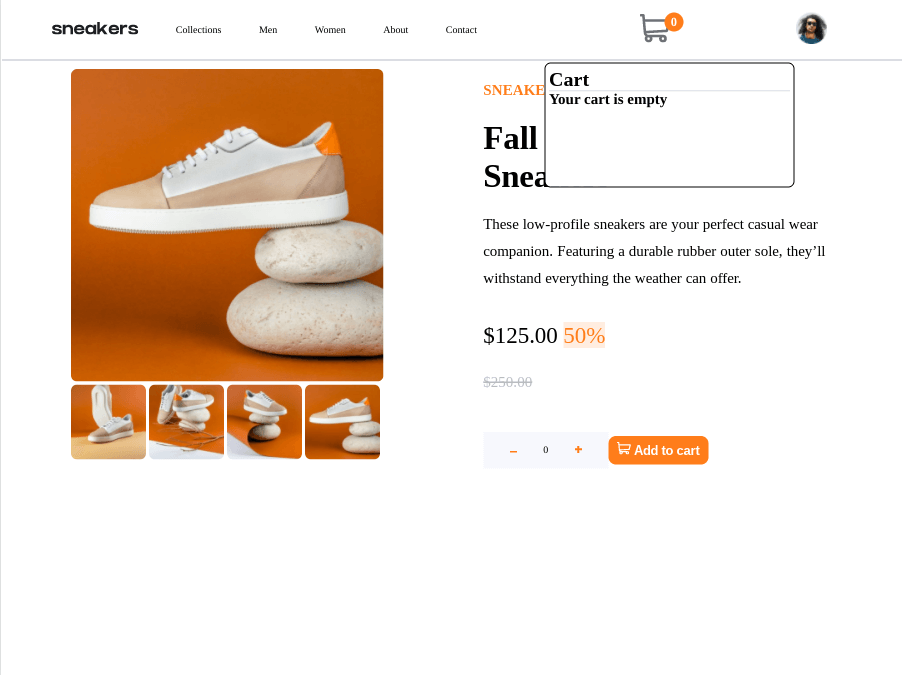
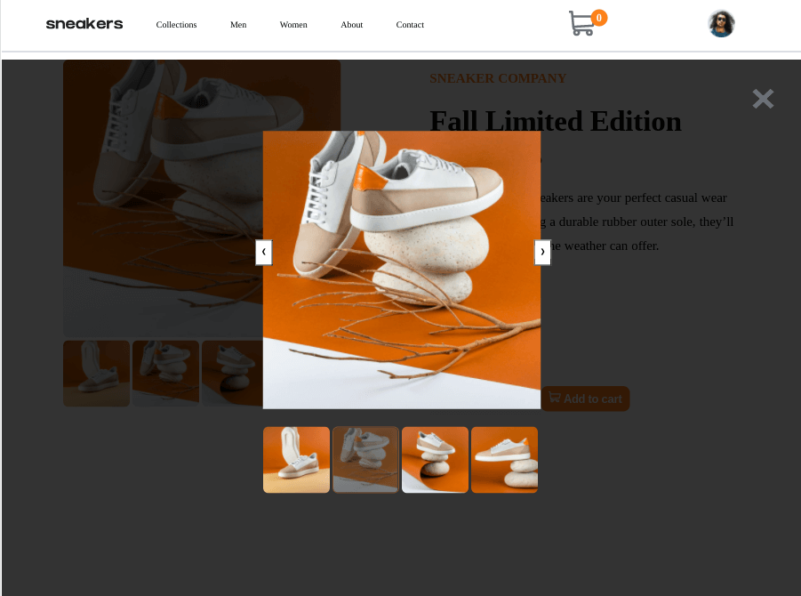
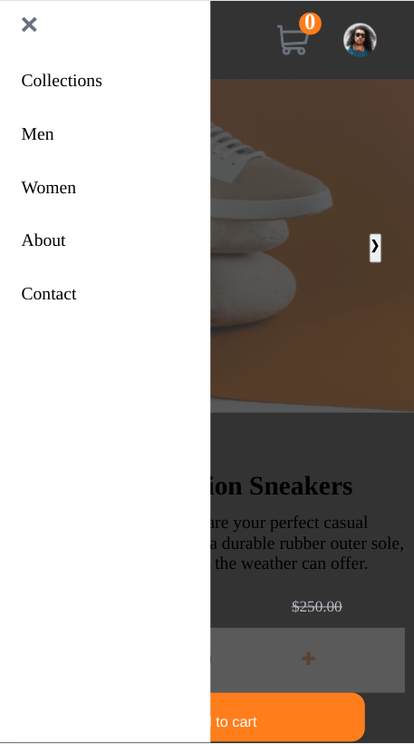

# Frontend Mentor - E-commerce product page solution

This is a solution to the [E-commerce product page challenge on Frontend Mentor](https://www.frontendmentor.io/challenges/ecommerce-product-page-UPsZ9MJp6). Frontend Mentor challenges help you improve your coding skills by building realistic projects.

## Table of contents

- [Overview](#overview)
  - [The challenge](#the-challenge)
  - [Screenshot](#screenshot)
  - [Links](#links)
- [My process](#my-process)
  - [Built with](#built-with)
  - [What I learned](#what-i-learned)
  - [Continued development](#continued-development)
  - [Useful resources](#useful-resources)

## Overview

### The challenge

Users should be able to:

- View the optimal layout for the site depending on their device's screen size
- See hover states for all interactive elements on the page
- Open a lightbox gallery by clicking on the large product image
- Switch the large product image by clicking on the small thumbnail images
- Add items to the cart
- View the cart and remove items from it

### Screenshot

### Links

- Live Site URL: [Github Pages](https://jdegand.github.io/ecommerce-product-page)

## My process

### Built with

- Semantic HTML5 markup
- CSS custom properties
- Flexbox
- Grid
- Mobile-first workflow

### What I learned

- Code duplication does prevent errors and clashes.     

### Continued development

- Class 'active' is not persisted on thumbnail when lightbox appears.
- Numerous style problems i.e. font etc

### Useful resources

- [W3 Schools](https://www.w3schools.com/howto/howto_js_lightbox.asp) - Lightbox
- [Stack Overflow](https://stackoverflow.com/questions/34135379/display-content-of-object-htmldivelement?rq=1) - Display object
- [Javascript Tutorial](https://www.javascripttutorial.net/dom/manipulating/remove-all-child-nodes/) - Remove all child nodes
- [Stack Overflow](https://stackoverflow.com/questions/30947430/best-way-to-have-a-javascript-load-only-on-desktop-version-of-site) - Javascript load vs screen size
- [MDN Docs](https://developer.mozilla.org/en-US/docs/Web/API/Window/resize_event) - Resize Event
- [Stack Overflow](https://stackoverflow.com/questions/14915653/refresh-page-on-resize-with-javascript-or-jquery) - Refresh on resize
- [Codepen](https://codepen.io/edubz/pen/wxbKwZ) - Image slider
- [Web Dev Trick](https://webdevtrick.com/css-menu-hover-underline/) - CSS Menu Hover Underline
- [Dev.to](https://dev.to/danielpdev/normalize-your-complex-js-objects-21d9) - Normalize
- [Geeks for Geeks](https://www.geeksforgeeks.org/extract-a-number-from-a-string-using-javascript/) - Regex to get number from string
